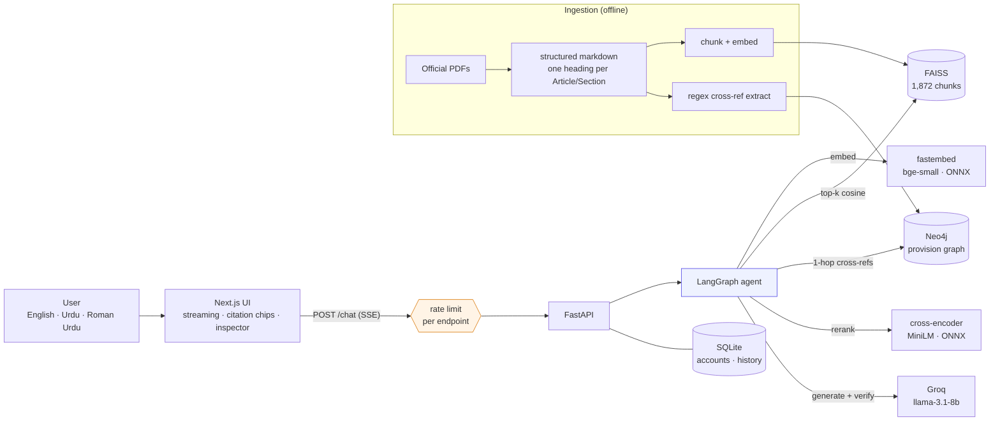
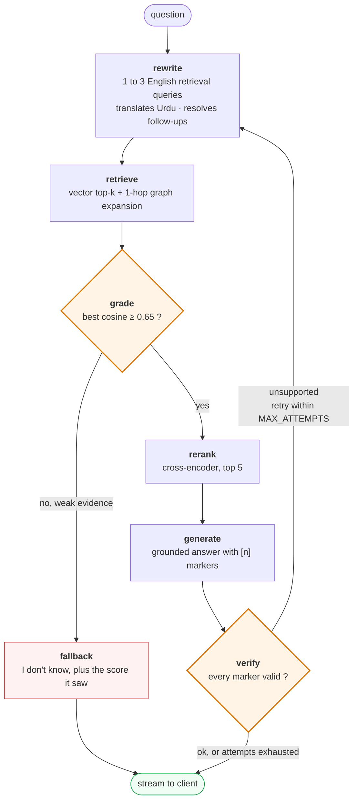
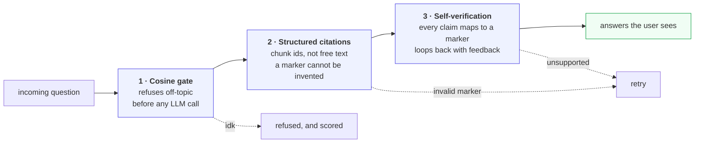
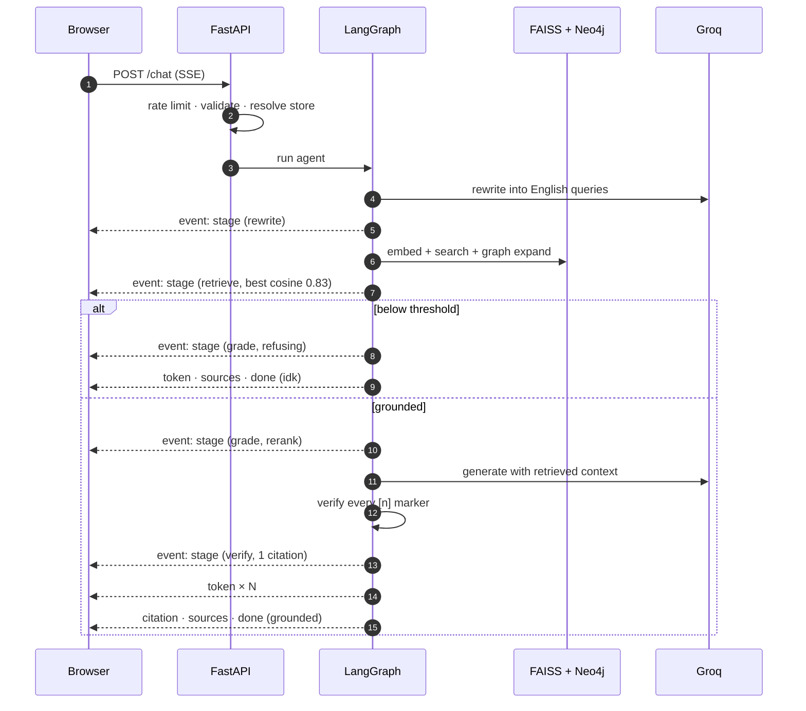
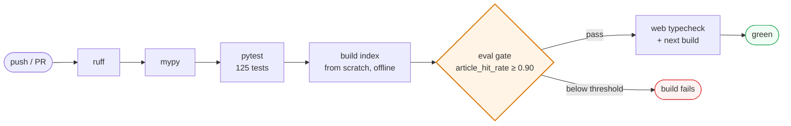

<div align="center">

# Pakistan Law Copilot

**A legal assistant that cites the provision, or admits it doesn't know.**

Grounded, citation-first retrieval over 16 Pakistani statutes. It answers from official
legal text, links the exact Article or Section, and refuses instead of guessing.

[](https://github.com/arhamchoudhary04/Knowledge-Copilot-/actions/workflows/ci.yml)


*Legal information, not legal advice.*

</div>

---

## What it does

Ask a plain "know your rights" question in **English, Urdu, or Roman Urdu**. There are two
outcomes, and both are intentional.

<table>
<tr>
<th width="50%">Covered by the corpus</th>
<th width="50%">Not covered</th>
</tr>
<tr valign="top">
<td>

> **"Do I have a right to a fair trial?"**

Yes. For the determination of civil rights and
obligations or in any criminal charge, a person
is entitled to a fair trial and due process **[1]**.

`[1]` **Article 10A**, Right to fair trial
*Constitution of Pakistan, Fundamental Rights*

```
answer_status: grounded
attempts:      1
best cosine:   0.83
```

</td>
<td>

> **"What is the capital of France?"**

I don't know based on the available sources.
I searched the corpus but the most relevant
passage scored only **0.52**, below the
confidence threshold.

*No citations. No guess.*

```
answer_status: idk
gate:          0.52 < 0.65, refused
LLM:           never called
```

</td>
</tr>
</table>

The second column is the point. A legal assistant that confidently invents a section
number is worse than useless, so refusal is a first-class outcome here: measured, and
gated in CI alongside accuracy.

---

## The problem this solves

Retrieval-augmented generation fails in three ways that matter more in law than almost
anywhere else. Each one gets a structural answer in this codebase rather than a line in a
prompt.

| Failure mode | Why a prompt can't fix it | What is built instead |
|---|---|---|
| **Answering off-topic questions** | The model always produces *something* | A cosine relevance gate refuses **before** the LLM is called |
| **Fabricated citations** | "Only cite real sections" is unenforceable | Citations are chunk **ids**, not text the model can invent |
| **Claims not in the source** | Single-pass self-critique is unreliable | A verify node re-checks every marker and loops back with feedback |

---

## Results

Measured over a 50-question golden set: 48 answerable across all 16 acts, 2 genuinely
uncovered. Every answerable question is annotated with the provision that should answer it.

| Metric | Value | CI gate | What it actually measures |
|---|:---:|:---:|---|
| **`article_hit_rate`** | **0.958** | ≥ 0.90 | The exact **Section or Article** is retrieved. The honest number. |
| `retrieval_hit_rate` | 0.979 | ≥ 0.90 | The correct **Act** is retrieved. Flatters, since any chunk counts. |
| `refusal_accuracy` | 1.000 | ≥ 0.90 | Genuinely unanswerable questions are refused. |
| `over_refusal_rate` | 0.000 | ≤ 0.10 | Answerable questions are *not* wrongly refused. |

All four clear their gate, and CI fails the build if any of them stops doing so.

Both hit rates are published on purpose. Document-level is the number most projects quote
because it looks better; provision-level (**0.958**, or 46 of 48) is the one that reflects
whether the citation is actually right.

**The two misses are documented rather than reworded away.** Both are semantic near-misses
where a closely related section outranks the expected one. In one case a false-accusation
question surfaces PPC §496C, itself a correct provision, above the Qazf Ordinance section
the golden set expects. A believable 0.958 with named failures is worth more than a
gamed 1.00.

<details>
<summary><b>How 0.88 became 0.958, and why it counts as a fix rather than tuning</b></summary>

An earlier run sat at 0.88. The cause was neither the model nor the threshold: a chunking
filter was discarding short-but-real provisions as table-of-contents noise. The theft
punishment clause, PPC §379, is about 90 characters long, and it was being thrown away.

Lowering that filter recovered roughly **150 legitimate provisions**. The metric then
*held* as the corpus tripled to 16 acts and the golden set grew to 50 questions, which is
the part that suggests a genuine fix rather than an overfit to the questions.

</details>

<details>
<summary><b>Retrieval ablation: the reranker is measured, not assumed</b></summary>

| Configuration | `hit_rate@k` | `context_precision@k` |
|---|:---:|:---:|
| vector-only | 0.979 | 0.717 |
| vector + cross-encoder rerank | 0.979 | **0.742** |

The cross-encoder buys a modest precision gain and changes no hit-rate outcome. More
interesting: the effect *flipped* with chunking. On earlier coarse chunks the same
reranker slightly hurt (0.700 down to 0.695), and it helped on a generic docs corpus
(0.71 up to 0.75).

So the conclusion is not "reranking helps". It is that the value of reranking is corpus-
and chunking-dependent, which is why it ships behind `--ablation` and gets re-measured
instead of assumed.

</details>

```bash
python eval/run_eval.py              # retrieval + refusal (offline, no API key)
python eval/run_eval.py --ablation   # + vector-only vs vector+rerank
python eval/run_eval.py --generate   # + citation validity (needs a key)
python eval/run_eval.py --check      # the CI gate
```

---

## Architecture



Everything except the Groq call runs locally and free. Embeddings and reranking are ONNX
via `fastembed` with no torch, the index is FAISS on disk, and accounts sit in stdlib
`sqlite3`.

---

## The agent

`/chat` is a LangGraph state machine rather than a chain, because the verification loop
needs explicit state and conditional edges.



### Three layers between a question and a wrong answer



**Verification completes before the first token reaches the client**, so the user never
sees a claim that later gets retracted. The cost is latency, and it is paid down by
streaming per-stage progress into a live inspector, which makes the wait legible instead
of blank.

---

## Request lifecycle



### SSE event contract

```
event: stage     data: {"stage":"rerank","detail":"...","latency_ms":12.3}
event: token     data: {"text":"..."}
event: citation  data: {"marker":1,"chunk_id":"...","source":"...","section":"..."}
event: sources   data: {"retrieved":[{"chunk_id":"...","score":0.82,"rerank_score":8.76,"used":true}]}
event: done      data: {"message_id":"...","answer_status":"grounded|idk|partial","attempts":1}
```

`stage` events power the Retrieval Inspector in the UI: per-node latency, plus every
candidate chunk with its cosine and rerank scores. The consumer is a hand-written
SSE-over-fetch client, because `/chat` is a POST and the browser's `EventSource` is
GET-only.

---

## Engineering decisions

The parts worth interviewing about.

<table>
<tr><td width="34%"><b>Trust-first, not answer-first</b></td><td>

Three independent layers stop confident-but-wrong output: a relevance gate that runs
*before* the LLM, citations as structured ids, and a bounded self-verification loop.
Refusal is measured (`refusal_accuracy`, `over_refusal_rate`) and gated in CI.

</td></tr>
<tr><td><b>The gate stays cosine-based</b></td><td>

`RELEVANCE_THRESHOLD` (0.65) is calibrated against a measured score gap on this corpus:
on-topic questions score 0.78 or above, off-topic 0.53 or below. Cross-encoder logits are
not comparable to cosine, so the gate runs *before* reranking rather than on the
better-ordered list.

</td></tr>
<tr><td><b>Reranking is measured</b></td><td>

The ablation shows the effect is small and **flips with chunking**. It ships as a
per-corpus measurement (`--ablation`) rather than a default that nobody checked.

</td></tr>
<tr><td><b>Citation accuracy over coverage</b></td><td>

The Constitution's Fundamental Rights chapter is hand-verified against the official text
rather than auto-parsed, because a mislabelled "Article 25" is worse than missing content.
Cleanly structured statutes are auto-converted from PDF.

</td></tr>
<tr><td><b>Hybrid retrieval via a graph</b></td><td>

Provisions cite each other ("subject to Article 251"). A Neo4j graph captures those edges,
extracted by regex with no LLM involved, so retrieval can follow a reference that the
vector score ranked below the cutoff. It degrades to vector-only if Neo4j is unreachable.

</td></tr>
<tr><td><b>Translate the query, not the corpus</b></td><td>

English legal text stays the source of truth. The agent translates the *question* for
retrieval and answers back in the user's language and script, keeping provision names in
English. Translating the statutes themselves would risk shipping a mistranslated law.

</td></tr>
<tr><td><b>Blocking work stays off the event loop</b></td><td>

Embedding, FAISS search, and PDF ingestion are synchronous CPU work, so they run in a
threadpool. Otherwise one request serializes every other, in-flight SSE streams included.
The rate limiter is pure ASGI for the same reason: `BaseHTTPMiddleware` rewraps
receive/send, which breaks streaming and `request.is_disconnected()`.

</td></tr>
<tr><td><b>Local-first and free</b></td><td>

Local ONNX embeddings and reranker, FAISS, stdlib SQLite, and a free LLM tier run at
roughly \$0. The LLM sits behind an interface, so the provider is swappable.

</td></tr>
</table>

---

## Tech stack

### Retrieval and ranking

| Component | Choice | Why this one |
|---|---|---|
| Embeddings | `fastembed` with `BAAI/bge-small-en-v1.5`, 384-dim | Local ONNX, no torch, no API key, small enough to cache in CI |
| Vector store | FAISS `IndexFlatIP` over L2-normalized vectors | Inner product equals cosine, and exact search at this corpus size |
| Reranker | `fastembed` cross-encoder, `ms-marco-MiniLM-L-6-v2` | Local ONNX, and its contribution is quantified rather than assumed |
| Knowledge graph | Neo4j provision cross-reference graph | Multi-hop retrieval over citations; optional, degrades cleanly |
| Chunking | Header-aware split, then token windows | One provision per chunk is what makes a citation exact |

### Generation and orchestration

| Component | Choice | Why this one |
|---|---|---|
| LLM | Groq free tier, `llama-3.1-8b-instant` | OpenAI-compatible, \$0, and behind an interface so it is swappable |
| Agent | LangGraph state machine | Conditional edges and explicit state for the verify-and-retry loop |
| Prompting | Structured context blocks with `[n]` markers | Markers resolve to chunk ids, so a citation cannot be fabricated |

### Application

| Component | Choice | Why this one |
|---|---|---|
| API | FastAPI with Pydantic v2 | Typed request and response boundaries, generated OpenAPI docs |
| Streaming | `sse-starlette` over a POST endpoint | Per-stage progress events, not just the final answer |
| Accounts and history | stdlib `sqlite3`, PBKDF2-HMAC-SHA256, HMAC tokens | Zero new dependencies for storage, hashing, and token signing |
| Rate limiting | stdlib sliding window, pure ASGI middleware | Zero new dependencies, and no interference with SSE |
| Ingestion | `pypdf` to structured markdown | One heading per Article or Section, which the chunker relies on |

### Frontend

| Component | Choice | Why this one |
|---|---|---|
| Framework | Next.js App Router with TypeScript | Server components for the static pages, client only where needed |
| Styling | Tailwind, hand-built tokens | No component library to fight; a four-step charcoal ramp and a brass accent, every text pair checked against WCAG AA |
| SSE client | Hand-written over `fetch` | `EventSource` is GET-only, and `/chat` is a POST with a JSON body |
| Dependencies | `next`, `react`, `react-dom`, and nothing else | 2,114 lines of TypeScript with zero `any` and no runtime extras |

### Quality

| Component | Choice | Why this one |
|---|---|---|
| Lint and format | `ruff` | One tool, and it runs over `eval/` too |
| Types | `mypy` with the Pydantic plugin | Clean across 36 source files |
| Tests | `pytest` with `pytest-asyncio` | 125 tests, fully offline |
| Evaluation | Golden set, custom metrics, ablation, CI gate | A retrieval regression fails the build like a broken test |

### Not in the stack, and why

| Left out | Reason |
|---|---|
| A managed vector DB (Pinecone, Weaviate) | FAISS is exact and free at 1,872 chunks; a hosted index would add cost and latency for nothing |
| Postgres and Redis | SQLite carries accounts and history fine for a single process; the trade-off is documented in Known limitations |
| `torch` | ONNX runtime through `fastembed` covers embeddings and reranking at a fraction of the install size |
| A JWT library | Session tokens are HMAC-signed and typed in about 40 lines of stdlib, and the properties that usually go wrong are tested |
| A rate-limit library (`slowapi`) | A sliding window is a deque of timestamps; a dependency would also have pulled in `BaseHTTPMiddleware` behaviour that breaks SSE |
| LangChain agents | LangGraph alone gives the state machine; the rest of the framework was not needed |

---

## Corpus

16 acts, **1,872 chunks**, chosen around everyday rights rather than breadth.

| Domain | Statutes |
|---|---|
| **Constitutional** | Constitution of Pakistan, Fundamental Rights (Articles 8&ndash;28), *hand-verified* |
| **Criminal** | Pakistan Penal Code 1860 · Code of Criminal Procedure 1898 · Offence of Qazf Ordinance 1979 |
| **Family** | Muslim Family Laws Ordinance 1961 · Dissolution of Muslim Marriages Act 1939 · Family Courts Act 1964 · Guardians and Wards Act 1890 · Dowry and Bridal Gifts Act 1976 |
| **Civil and commercial** | Contract Act 1872 · Punjab Consumer Protection Act 2005 · Punjab Rented Premises Act 2009 |
| **Digital and workplace** | PECA 2016 · Harassment of Women at the Workplace Act 2010 · Standing Orders Ordinance 1968 |
| **Transparency** | Right of Access to Information Act 2017 |

Rent and consumer protection are provincial subjects, so the Punjab statutes are used and
labelled as such. Sources are official public texts from
[pakistancode.gov.pk](https://pakistancode.gov.pk/),
[punjabcode.punjab.gov.pk](https://punjabcode.punjab.gov.pk/), and
[kpcode.kp.gov.pk](https://kpcode.kp.gov.pk/).

**The architecture is domain-agnostic.** Drop different markdown into `data/corpus/`,
re-run `build_index`, and restart. Nothing else changes.

---

## Security and abuse limits

Auth is hand-rolled on the standard library, so the details that usually go wrong are
tested explicitly.

- **PBKDF2-HMAC-SHA256**, 200k iterations, per-user random salt, constant-time comparison.
- **Typed tokens.** A password-reset token is cryptographically distinct from a session
  token and cannot stand in for one.
- **No account enumeration.** A wrong password and an unknown email return an identical
  response, and `forgot-password` never reveals whether an email exists.
- **Every history query is scoped by `user_id`**, and a cross-user attempt returns `404`
  rather than `403`, which would confirm the record exists.
- **Fail-fast in production.** The app refuses to boot with `APP_ENV=production` while
  `AUTH_SECRET` is the default or `AUTH_DEV_RESET` is on.

### Rate limiting

Three paths are expensive enough that an unlimited caller is a genuine problem, so each
gets its own budget (`app/core/ratelimit.py`).

| Endpoint | Budget | Why this one needs it |
|---|:---:|---|
| `/auth/login` | 5 / min | PBKDF2 costs about **165 ms per attempt**, making it both a guessing oracle and a cheap way to pin the CPU and starve every other request |
| `/chat` | 20 / min | Unauthenticated by design, one Groq call per request, so a script can burn the whole free quota |
| `/documents` | 3 / min | Parses and embeds a PDF, the heaviest CPU work in the app |
| `/auth/signup`, `/auth/reset-password` | 10 / hr, 5 / hr | Account and token spam |
| `/auth/forgot-password` | 3 / hr | Reset-token spam |
| `/health` | unlimited | Monitoring has to keep working |

Two details that are easy to get wrong:

- **The window slides.** A fixed window lets a caller send twice the limit across a
  boundary, which per-key timestamps prevent.
- **`X-Forwarded-For` is ignored by default.** It is client-supplied, so trusting it means
  anyone can reset their own budget by varying it. Set `RATE_LIMIT_TRUST_PROXY=true` only
  behind a proxy that overwrites the header.

A size cap and a rate limit solve different problems. The 10 MB upload cap bounds *one*
request; only the rate limit bounds a thousand of them.

---

## Testing and CI

**125 tests, all offline.** No API key, no network, no model download. Test code is 57% the
size of application code, 1,754 lines against 3,075.

| Suite | Tests | Covers |
|---|:---:|---|
| `test_ratelimit` | 20 | Sliding window, rule matching, 429, spoofed `X-Forwarded-For` |
| `test_api_chat` | 18 | SSE contract, refusal path, upload guards, `/health` |
| `test_store` | 17 | Per-user scoping (IDOR), turn ordering, cascade delete |
| `test_api_auth` | 14 | No enumeration, forged token, deleted account, typed reset token |
| `test_auth_security` | 12 | PBKDF2 round-trip, tampering, expiry, production boot guard |
| `test_legal_pdf` | 10 | Short-provision recovery, TOC dedupe, footnote rejection |
| `test_api_conversations` | 9 | Cross-user 404, round-trip with citations |
| *units* | 25 | Chunker, reranker, vector store, agent graph, verify loop, language |

CI runs on every push, and a retrieval regression fails the build exactly like a broken
test would.



Two things here are worth calling out.

**The SSE contract is pinned against the real client.** `test_api_chat.py` parses the
stream with a faithful mirror of `apps/web/lib/sse.ts`, so a change to the backend's
framing fails a Python test instead of silently breaking the UI. That framing has already
bitten this project once: `sse-starlette` separates events with `\r\n\r\n`, which contains
no `\n\n` to split on.

**The IDOR guard is pinned.** Every conversation query is scoped by `user_id`, and a
refactor dropping an `AND user_id = ?` would leak one user's chat history to another. Now
it fails the suite instead.

```bash
cd apps/api
ruff check .    # clean
mypy app        # clean, 36 files
pytest          # 125 passed
```

Most of the suite's runtime is real PBKDF2 hashing at the production iteration count. The
auth tests are not handed a cheaper hash on purpose.

---

## Repository map

```
apps/
  api/                     FastAPI backend
    app/
      agent/               LangGraph graph, prompts, language detection
      retrieval/           FAISS store, cross-encoder reranker, Neo4j graph store
      ingestion/           PDF to markdown, index/graph builders, PDF uploads
      core/                settings, embeddings, LLM client, rate limiting
      auth/                PBKDF2 hashing, signed and typed session/reset tokens
      db/                  SQLite store for accounts and chat history
      routers/             /chat  /documents  /auth  /conversations  /health
    tests/                 125 tests: units plus TestClient over every route
  web/                     Next.js: chat, landing, Browse-the-law, auth, history
data/
  corpus/                  structured-markdown statutes (committed, indexed)
  raw/                     official source PDFs (gitignored)
eval/                      golden set (50 Q) + metrics + ablation + CI gate
.github/workflows/         lint · types · tests · index build · eval gate · web build
```

---

## Run it locally

Requires **Python 3.11+** and **Node 18+**.

```bash
# 1. Install the API
python -m venv .venv
.venv\Scripts\activate            # Windows
source .venv/bin/activate         # macOS / Linux
pip install -e "apps/api[dev]"

# 2. Configure
cp .env.example .env
# Set GROQ_API_KEY (free, no card: https://console.groq.com/keys).
# Retrieval and the refusal path work with no key at all; only generation needs one.

# 3. Build the index (downloads about 130MB of ONNX models on first run)
cd apps/api && python -m app.ingestion.build_index

# 4. Run
uvicorn app.main:app --reload              # API  http://localhost:8000/docs
cd ../web && npm install && npm run dev    # UI   http://localhost:3000
```

Try both paths from the command line:

```bash
# grounded, cites Article 10A
curl -N -X POST http://localhost:8000/chat \
  -H "Content-Type: application/json" \
  -d '{"message": "Do I have a right to a fair trial?"}'

# refusal, nothing clears the threshold and no citation is invented
curl -N -X POST http://localhost:8000/chat \
  -H "Content-Type: application/json" \
  -d '{"message": "What is the capital of France?"}'
```

<details>
<summary><b>Optional: Neo4j knowledge graph for hybrid retrieval</b></summary>

Legal provisions cross-reference each other, and a graph captures those links so retrieval
can follow them instead of only matching text:

```
(:Provision {key, act, number, title}) -[:REFERENCES]-> (:Provision)
(:Provision) -[:IN_ACT]-> (:Act)
```

Edges are extracted from provision text with regex (`graph_refs.py`), with no LLM involved.
Set `GRAPH_ENABLED=true` and the `NEO4J_*` values in `.env`, then:

```bash
cd apps/api && python -m app.ingestion.build_graph
```

At query time, `retrieve` runs vector search plus a 1-hop graph expansion that pulls in
cross-referenced provisions the vector score ranked below the cutoff, flagged `via_graph`
in the inspector. Asking *"how can a marriage be dissolved other than by talaq?"* retrieves
§8 (Dissolution) by vector, and the graph adds the §2 (Definitions) that §8 references.

If Neo4j is unreachable, retrieval falls back to vector-only. Use `neo4j+s://` normally, or
`neo4j+ssc://` behind a TLS-inspecting proxy.

</details>

<details>
<summary><b>Optional: regenerate a statute from its PDF</b></summary>

`app/ingestion/legal_pdf.py` converts an official PDF into structured markdown, one heading
per Section or Article. Drop the PDF in `data/raw/` and run
`python -m app.ingestion.legal_pdf`.

The Constitution's Fundamental Rights chapter is hand-transcribed rather than auto-parsed,
because citation accuracy matters more than automation there.

</details>

---

## Known limitations

Called out here rather than discovered later. This is a portfolio project, and a few things
are intentionally demo-grade.

- **Auth is demo-grade.** PBKDF2 hashing and HMAC session tokens are hand-rolled. Login is
  rate limited, but there is no account lockout, tokens live in `localStorage`, sessions
  cannot be revoked, and reset tokens are not single-use. A real deployment should use a
  hardened or managed provider.
- **`/chat` and `/documents` take no authentication** (open demo). Rate limiting and the
  10 MB cap bound the abuse, but anyone who can reach the API can spend the LLM quota.
- **Rate-limit counters are per-process.** Running two instances doubles the effective
  limit, so a multi-instance deployment wants a shared store such as Redis.
- **Single-process and in-memory.** FAISS and SQLite are local and not horizontally
  scalable. Uploaded documents live in a process-global ephemeral registry that is not
  concurrency-safe.
- **The corpus is a point-in-time snapshot.** There is no amendment-date tracking, and laws
  change. Retrieval is not jurisdiction-aware, and provincial subjects use Punjab statutes
  only.
- **Generation uses a small 8B model.** The trust layers mitigate but do not eliminate
  subtle legal errors, and a 50-question golden set is a signal rather than a guarantee.

---

## Disclaimer and attribution

**This is legal information, not legal advice.** Answers are generated from a limited
corpus and may be incomplete or out of date. Always verify against the cited official
source, and consult a qualified lawyer for your situation.

The corpus under `data/corpus/` is derived from official public texts of Pakistani law
obtained from [pakistancode.gov.pk](https://pakistancode.gov.pk/) and the provincial code
sites. The Fundamental Rights chapter is hand-transcribed from the official Constitution
text; other statutes are parsed from their official PDFs. Provided for informational and
educational use.
