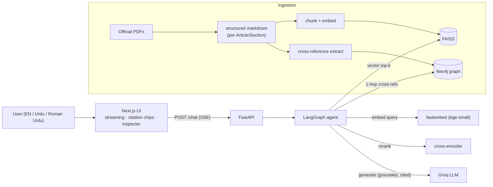

# Pakistan Law Copilot

[](https://github.com/arhamchoudhary04/Knowledge-Copilot-/actions/workflows/ci.yml)

A grounded, citation-first assistant over Pakistani law. It answers only from
official legal sources, cites the exact provision, and says *"I don't know"* when
the law doesn't cover the question, instead of guessing. Legal information, not
legal advice.

It handles everyday "know your rights" questions ("What are my rights if I'm
arrested?", "Do I have a right to a fair trial?", "Someone shared my private photos
without consent, what does the law say?"), grounding each answer in the Constitution
or a statute and linking to the exact Article or Section.

## Corpus

Version 1 covers 16 acts (~1,870 chunks), chosen around everyday rights:

- **Constitution of Pakistan, Fundamental Rights** (Part II, Chapter 1, Articles
  8–28), hand-verified against the official text.
- **Pakistan Penal Code, 1860 (PPC):** theft, murder (qatl), cheating, cheque fraud.
- **Code of Criminal Procedure, 1898 (CrPC):** arrest, bail, FIR / cognizable offences.
- **Contract Act, 1872:** valid agreements, breach, remedies.
- **Muslim Family Laws Ordinance, 1961:** marriage, talaq, maintenance, polygamy.
- **Dissolution of Muslim Marriages Act, 1939:** a woman's grounds for divorce (khula).
- **Family Courts Act, 1964:** jurisdiction and procedure for maintenance, dower,
  custody, and guardianship suits.
- **Guardians and Wards Act, 1890:** custody and guardianship of minors.
- **Offence of Qazf (Enforcement of Hadd) Ordinance, 1979:** falsely accusing someone
  of *zina*.
- **Dowry and Bridal Gifts (Restriction) Act, 1976:** limits on dowry.
- **Prevention of Electronic Crimes Act, 2016 (PECA):** cybercrime, online harassment.
- **Protection against Harassment of Women at the Workplace Act, 2010.**
- **Right of Access to Information Act, 2017:** requesting public records.
- **Punjab Rented Premises Act, 2009:** landlord/tenant rights, eviction.
- **Punjab Consumer Protection Act, 2005:** defective products and services.
- **Standing Orders Ordinance, 1968:** industrial employment, retrenchment.

Rent and consumer protection are provincial subjects, so the Punjab statutes are
used and labelled as such. Sources are official public texts from
[pakistancode.gov.pk](https://pakistancode.gov.pk/),
[punjabcode.punjab.gov.pk](https://punjabcode.punjab.gov.pk/), and
[kpcode.kp.gov.pk](https://kpcode.kp.gov.pk/). The architecture is domain-agnostic:
swap the files under `data/corpus/` to retarget it.

## What's built

- Ingestion: PDF to structured markdown, then chunk, embed, and index into FAISS.
- A LangGraph agent: query rewrite, hybrid retrieval (vector + Neo4j graph),
  cross-encoder reranking, a relevance gate that refuses gracefully, and
  self-verification.
- A streaming `/chat` endpoint with inline citations and a per-stage inspector trace.
- Conversation memory for follow-ups, and bring-your-own-PDF document Q&A.
- User accounts with per-user chat history.
- A Next.js web UI: a landing page, a *Browse the law* explorer, and the chat.
- English / Urdu / Roman-Urdu input.
- An evaluation harness with a retrieval ablation, enforced as a CI gate.

## Stack

Lean, free, and local-first by design:

| Layer | Choice |
|---|---|
| API | FastAPI + Pydantic v2, SSE streaming (`sse-starlette`) |
| Agent | LangGraph state machine (rewrite → retrieve → grade → rerank → generate → verify) |
| Generation | Groq free API (`llama-3.1-8b-instant`), OpenAI-compatible |
| Embeddings | `fastembed` local (`BAAI/bge-small-en-v1.5`, 384-dim), no API key |
| Reranker | `fastembed` local cross-encoder (`Xenova/ms-marco-MiniLM-L-6-v2`, ONNX, no torch) |
| Vector store | FAISS flat inner-product over L2-normalized vectors (cosine) |
| Knowledge graph | Neo4j provision cross-reference graph for hybrid retrieval (optional) |
| Ingestion | `pypdf` → structured markdown (per Article/Section), then header + token chunking |
| Accounts & history | SQLite (stdlib `sqlite3`): PBKDF2-HMAC passwords, HMAC-signed session tokens |
| Eval | Golden set + custom retrieval/refusal metrics + ablation |
| Web UI | Next.js (App Router) + TypeScript + Tailwind, custom SSE-over-fetch client |

Accounts and history add no new dependencies; the standard library covers storage,
password hashing, and token signing. A managed vector DB and a Postgres/Redis tier
are deferred on purpose, which keeps the whole thing single-process and free to run.

## Architecture



## Agent flow

`/chat` is driven by a LangGraph agent (`app/agent/graph.py`):

```
rewrite ──► retrieve ──► grade ──(weak evidence)──► fallback ("I don't know")
                           │
                       (relevant)
                           ▼
                 rerank ──► generate ──► verify ──(ok / attempts exhausted)──► answer
                           ▲                 │
                           └──(unsupported)──┘   loop back with feedback, capped at MAX_ATTEMPTS
```

- **rewrite** expands the question into retrieval queries (falls back to the raw
  query if the LLM is unavailable).
- **grade** is the trust gate: it refuses when the best cosine is below
  `RELEVANCE_THRESHOLD` rather than guess, and stays cosine-based even though rerank
  reorders afterwards.
- **rerank** reorders candidates with a cross-encoder; its effect here is small and
  corpus-dependent (quantified by the ablation below).
- **verify** checks every claim maps to a valid citation and loops back on unsupported
  ones, bounded by `MAX_ATTEMPTS`.

Citations are structured data (chunk ids), not free text the model can fabricate.
Verification finishes before any token reaches the client, so the user only ever
sees a self-verified answer.

## Repository layout

```
apps/
  api/                 FastAPI backend
    app/
      agent/           LangGraph graph, prompts, language detection
      retrieval/       FAISS vector store, cross-encoder reranker, Neo4j graph store
      ingestion/       PDF → markdown converter, index/graph builders, PDF uploads
      auth/            PBKDF2 password hashing + signed session/reset tokens (HMAC)
      db/              SQLite store for accounts + chat history
      routers/         /chat, /documents, /auth, /conversations, /health
  web/                 Next.js frontend: chat, landing, Browse-the-law, auth + history
data/
  corpus/              structured-markdown statutes (the retrieval corpus, committed)
  raw/                 official source PDFs (gitignored)
eval/                  golden set + evaluation harness
.github/workflows/     CI: lint, types, tests, index build, eval gate, web build
```

## Setup

Requires Python 3.11+ and Node 18+.

```bash
# 1. Create a virtualenv and install the API (editable) with dev extras
python -m venv .venv
# Windows:  .venv\Scripts\activate       macOS/Linux:  source .venv/bin/activate
pip install -e "apps/api[dev]"

# 2. Configure environment
cp .env.example .env
# Set GROQ_API_KEY (free, no card: https://console.groq.com/keys).
# Retrieval and the refusal path work without a key; generation needs it.
```

## Build the index

```bash
cd apps/api
python -m app.ingestion.build_index
```

Loads `data/corpus`, chunks it, embeds with fastembed (downloads ~130MB on first
run), and writes a FAISS index + `chunks.json` into `.data/`.

### Regenerating a statute from its PDF (optional)

`app/ingestion/legal_pdf.py` converts an official PDF to structured markdown, one
heading per Section/Article. To add or refresh one, drop the PDF in `data/raw/` and
run `python -m app.ingestion.legal_pdf`. The Constitution's Fundamental Rights
chapter is hand-verified rather than auto-parsed, because citation accuracy matters
more than automation there (see the note in `legal_pdf.py`).

## Knowledge graph & hybrid retrieval (optional)

Legal provisions cite each other ("subject to Article 251", "under section 7"). A
Neo4j graph captures those links so retrieval can follow them, not just match text:

```
(:Provision {key, act, number, title}) -[:REFERENCES]-> (:Provision)   # same Act
(:Provision) -[:IN_ACT]-> (:Act)
```

Edges are extracted from provision text with regex (`graph_refs.py`), no LLM. Build
the graph after indexing:

```bash
# set GRAPH_ENABLED=true + NEO4J_* in .env first
cd apps/api
python -m app.ingestion.build_graph      # e.g. 1,595 provisions, 599 references
```

At query time the `retrieve` node runs hybrid retrieval: vector search plus a 1-hop
graph expansion that pulls in cross-referenced provisions the vector score ranked
below the cutoff (flagged `via_graph` in the inspector). Asking "how can a marriage
be dissolved other than by talaq?" retrieves §8 (Dissolution) by vector, and the
graph adds the §2 (Definitions) that §8 references.

If `GRAPH_ENABLED=false` or Neo4j is unreachable, retrieval falls back to vector-only.
Connections use `neo4j+s://`; behind a TLS-inspecting proxy use `neo4j+ssc://`
(encrypted, skips cert verification).

## Run the API

```bash
cd apps/api
uvicorn app.main:app --reload
```

- Swagger UI: http://localhost:8000/docs
- Health:     http://localhost:8000/health

### Try a grounded question

```bash
curl -N -X POST http://localhost:8000/chat \
  -H "Content-Type: application/json" \
  -d '{"message": "Do I have a right to a fair trial?"}'
```

You'll see `stage` events (the inspector trace), then `token` events streaming the
answer, then `citation` and `sources` events, then `done` with
`answer_status: grounded`. This one cites Article 10A.

### Try the refusal path

```bash
curl -N -X POST http://localhost:8000/chat \
  -H "Content-Type: application/json" \
  -d '{"message": "What is the capital of France?"}'
```

Nothing clears the relevance threshold, so it returns `answer_status: idk` with no
fabricated citations.

## Web UI

A Next.js app (`apps/web`): a landing page, a *Browse the law* explorer over the
covered statutes, and the chat. The chat consumes the SSE stream with a streaming
answer, inline clickable citation chips into a source drawer, a collapsible
Retrieval Inspector (per-stage latency and ranked chunks with cosine/rerank scores),
and a trust-state badge (grounded / I-don't-know / partial).

```bash
cd apps/web
npm install
npm run dev        # http://localhost:3000  (expects the API on :8000)
```

Set `NEXT_PUBLIC_API_URL` if the API is not at `http://localhost:8000`. The API's
`CORS_ORIGINS` allows `http://localhost:3000` and `:3001` (Next's fallback port).

## Accounts, chat history & document upload

The app is gated behind sign-in, so each user gets their own saved history.

- **Accounts:** email/password sign-up (name + confirmed password), login, and a
  token-based password reset. Passwords use PBKDF2-HMAC-SHA256; session and reset
  tokens are HMAC-signed and typed (a reset token can't stand in as a session token),
  and forgot-password never reveals whether an email exists. Standard library only.
- **Per-user chat history:** a left sidebar lists your conversations; each turn is
  saved with its citations, so reopening a conversation restores its clickable
  sources. Every history endpoint is scoped to the signed-in account.
- **Storage:** a local SQLite file (`DATA_DIR/app.db`), kept separate from the Neo4j
  graph (which is wiped and rebuilt with the corpus).
- **Bring your own document:** upload a PDF and ask questions grounded in its pages
  instead of the law corpus, with the same grounded / cited / refuse behaviour.
  Uploaded documents are held in memory and never persisted.

See [Known limitations](#known-limitations) for the security caveats on this
demo-grade auth.

## Languages: English, Urdu & Roman Urdu

Ask in English, Urdu (Urdu script), or Roman Urdu (Urdu in Latin letters). The corpus
stays in the authoritative English legal text; language is handled at the two ends:

- The `rewrite` node translates the question to English for retrieval. Reranking then
  runs against that English query, since an English-only cross-encoder scoring a Urdu
  question would otherwise demote the correct article.
- The `generate` node replies in the user's language and script, but keeps provision
  names and citations in English (an Urdu answer still cites "Article 25A"). The UI
  renders Urdu-script messages right-to-left.

The small model doesn't reliably infer the answer language from the prompt alone, so a
deterministic detector (`app/agent/language.py`) tags each question (Urdu script,
Roman-Urdu function words, or an explicit "answer in English/Urdu" override) and hands
the generator an explicit instruction. Translation reuses the existing Groq call, so
it adds no extra API cost.

## SSE event contract

```
event: stage     data: {"stage": "rerank", "detail": "...", "latency_ms": 12.3}
event: token     data: {"text": "..."}
event: citation  data: {"marker": 1, "chunk_id": "...", "source": "...", "section": "..."}
event: sources   data: {"retrieved": [{"chunk_id": "...", "score": 0.82, "rerank_score": 8.76, "used": true}, ...]}
event: done      data: {"message_id": "...", "answer_status": "grounded|idk|partial", "attempts": 1}
```

The `stage` events (one per agent node, with latency) power the Retrieval Inspector.

## Evaluation

```bash
python eval/run_eval.py             # retrieval + refusal metrics (offline, no key)
python eval/run_eval.py --ablation  # + vector-only vs vector+rerank comparison
python eval/run_eval.py --generate  # + generation/citation metrics (needs GROQ_API_KEY)
```

Metrics run over the 50-item golden set in `eval/golden_set.jsonl` (48 answerable
across all 16 acts, 2 uncovered). Each answerable question is annotated with its
expected provision (e.g. `pakistan-penal-code-1860.md#302`).

| metric | value | what it measures |
|---|---|---|
| `retrieval_hit_rate` (document) | 0.979 | correct *Act* retrieved in top-k |
| `article_hit_rate` (provision) | 0.958 | correct *Section/Article* retrieved in top-k |
| `refusal_accuracy` | 1.00 | genuinely unanswerable questions refused |
| `over_refusal_rate` | 0.00 | answerable questions wrongly refused |

Both hit-rate numbers are reported on purpose. Document-level flatters (any chunk from
the right Act counts); article-level is the honest one (0.958 = 46/48). The two misses
are semantic near-misses where a closely related section outranks the exact expected
one, for example a false-accusation question surfacing PPC §496C (itself a correct
provision) over the Qazf Ordinance section the golden set expects. Questions aren't
reworded to pass: a believable 0.96 with documented misses beats a gamed 1.00. The CI
gate enforces `article_hit_rate ≥ 0.90`.

Getting here was a real fix, not tuning. An earlier 0.88 was partly caused by a
chunking filter that dropped short-but-real provisions, such as the theft punishment
clause §379 (~90 chars, discarded as table-of-contents noise). Lowering that threshold
recovered ~150 legitimate provisions, and the metric held as the corpus grew to 16 acts
and the golden set to 50 questions.

Two layers guard against wrong answers: the cosine gate refuses clearly off-topic
questions ("capital of France" scores 0.47), and for questions that are legally
adjacent but uncovered, the LLM refuses because the retrieved context doesn't actually
answer them.

### Retrieval ablation

| config | hit_rate@k | context_precision@k |
|---|---|---|
| vector-only | 0.979 | 0.717 |
| vector + rerank | 0.979 | 0.742 |

On this corpus the cross-encoder gives a modest precision gain (0.717 → 0.742) without
changing which Act is found. The effect flipped with chunking: on earlier coarse chunks
the same reranker slightly hurt (0.70 → 0.695), and it helped on a generic docs corpus
(0.71 → 0.75). The point isn't "rerank always helps"; it's that its value is corpus- and
chunking-dependent, so you measure it rather than assume it (`--ablation`).

## Quality gates

```bash
cd apps/api
ruff check .
mypy app
pytest
```

## Swap the corpus

Drop your own markdown into `data/corpus/` (or point `CORPUS_DIR` elsewhere), re-run
`build_index`, and restart the API. Nothing else changes.

## Design decisions

- **Trust-first, not answer-first.** Three layers stop confident-but-wrong answers: a
  cosine relevance gate that refuses off-topic questions before the LLM is called,
  structured citations (chunk ids, not free text), and a self-verification step that
  checks every claim maps to a cited provision.
- **Verify before streaming.** The agent verifies the answer before the first token
  reaches the client, so a user never sees a claim that later gets retracted. The
  trade-off is latency, mitigated by streaming per-stage progress to the UI.
- **The gate stays cosine-based.** Cosine is what's calibrated to `RELEVANCE_THRESHOLD`
  (0.65 for bge-small, from a measured on-topic/off-topic score gap); cross-encoder
  logits aren't comparable, so the gate runs before rerank.
- **Reranking is measured, not assumed.** The ablation shows the web-trained
  cross-encoder's effect is small and flips with chunking, so it's a per-corpus
  measurement rather than a cargo-culted default.
- **Citation accuracy over coverage.** The Constitution's Fundamental Rights chapter is
  hand-verified rather than auto-parsed, because a mislabelled "Article 25" is worse
  than missing content. Cleanly structured statutes are auto-converted from PDFs.
- **Hybrid retrieval via a graph.** A Neo4j graph (edges extracted deterministically)
  lets retrieval follow cross-references for multi-hop questions, and degrades to
  vector-only if Neo4j is unavailable.
- **Multilingual by translating the query, not the corpus.** The English text stays the
  source of truth; the agent translates the question for retrieval and answers back in
  the user's language, which avoids the risk of a mistranslated statute.
- **Local-first and free.** Local embeddings and reranker (fastembed, ONNX, no torch),
  FAISS, and a free LLM tier run at roughly $0. The LLM sits behind an interface, so the
  provider is swappable.
- **App data in SQLite, not the graph.** Accounts and history live in SQLite, kept apart
  from the Neo4j corpus graph that's rebuilt on every corpus change.

## Known limitations

This is a portfolio project, and a few things are intentionally demo-grade. They're
called out here rather than hidden.

- **Auth is demo-grade.** PBKDF2 password hashing and HMAC session tokens are hand-rolled
  on the standard library. There's no rate limiting or lockout, tokens live in
  `localStorage`, sessions can't be revoked, and reset tokens aren't single-use. As a
  guardrail the app refuses to start with `APP_ENV=production` while `AUTH_SECRET` is the
  default or `AUTH_DEV_RESET` is on, but a real deployment should use a hardened or
  managed auth provider.
- **`/chat` and `/documents` are unauthenticated** (open demo), and PDF upload has no
  rate limit, which is a compute-exhaustion vector. Add auth and rate limiting before
  exposing this publicly.
- **Single-process and in-memory.** The FAISS index and SQLite database are local and not
  horizontally scalable; uploaded documents live in a process-global, ephemeral registry
  that isn't concurrency-safe.
- **The corpus is a point-in-time snapshot.** There's no amendment-date tracking, and laws
  change, so always verify against the cited official source. Provincial subjects (rent,
  consumer) use the Punjab statutes only; retrieval is not jurisdiction-aware.
- **Generation uses a small (8B) model.** The trust layers mitigate but don't eliminate
  subtle legal errors, and the 50-item golden set is a signal, not a guarantee of
  real-world accuracy.

## Disclaimer & attribution

This is legal information, not legal advice. Answers are generated from a limited corpus
and may be incomplete or out of date. Always verify against the cited official source and
consult a qualified lawyer for your specific situation.

The corpus under `data/corpus/` is derived from official public texts of Pakistani law
obtained from [pakistancode.gov.pk](https://pakistancode.gov.pk/) and the provincial code
sites. The Fundamental Rights chapter is hand-transcribed from the official Constitution
text; other statutes are parsed from their official PDFs. Provided for informational and
educational use.
