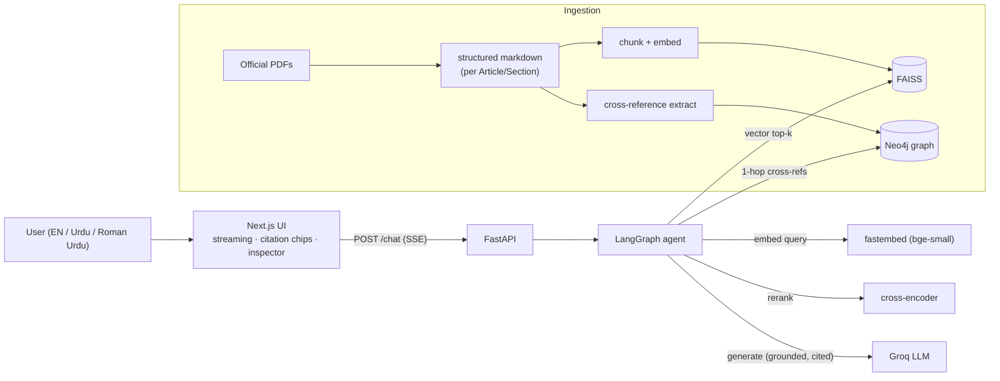

# Pakistan Law Copilot

[](https://github.com/arhamchoudhary04/Knowledge-Copilot-/actions/workflows/ci.yml)

A **grounded, citation-first** assistant over Pakistani law. It answers **only**
from official legal sources, cites the exact provision, and says *"I don't know"*
when the law doesn't cover the question — the opposite of a chatbot that
confidently makes things up. **Legal information, not legal advice.**

It answers everyday "know your rights" questions — *"What are my rights if I'm
arrested?"*, *"Do I have a right to a fair trial?"*, *"Someone shared my private
photos without consent — what does the law say?"* — grounding each answer in the
Constitution or a statute and linking to the exact Article/Section.

**Corpus (v1, everyday-rights) — 16 acts, ~1,870 chunks:**
- **Constitution of Pakistan — Fundamental Rights** (Part II, Chapter 1, Articles 8–28),
  hand-verified against the official text for citation accuracy.
- **Pakistan Penal Code, 1860 (PPC)** — offences: theft, murder (qatl), cheating, cheque fraud.
- **Code of Criminal Procedure, 1898 (CrPC)** — arrest, bail, FIR / cognizable offences.
- **Contract Act, 1872** — valid agreements, breach, remedies.
- **Muslim Family Laws Ordinance, 1961** — marriage, talaq/divorce, maintenance, polygamy.
- **Dissolution of Muslim Marriages Act, 1939** — a woman's grounds for divorce (khula).
- **Family Courts Act, 1964** — jurisdiction & procedure for maintenance, dower, custody and
  guardianship suits (its Schedule enumerates what a Family Court decides).
- **Guardians and Wards Act, 1890** — custody and guardianship of minors (the welfare-of-the-minor test).
- **Offence of Qazf (Enforcement of Hadd) Ordinance, 1979** — the offence of falsely accusing
  someone of *zina*.
- **Dowry and Bridal Gifts (Restriction) Act, 1976** — limits on dowry.
- **Prevention of Electronic Crimes Act, 2016 (PECA)** — cybercrime, online harassment.
- **Protection against Harassment of Women at the Workplace Act, 2010** — workplace harassment.
- **Right of Access to Information Act, 2017** — requesting public records.
- **Punjab Rented Premises Act, 2009** — landlord/tenant rights, eviction.
- **Punjab Consumer Protection Act, 2005** — defective products, services.
- **Industrial and Commercial Employment (Standing Orders) Ordinance, 1968** — employment, retrenchment.

Rent and consumer protection are provincial subjects, so the Punjab statutes are
used (labelled as such). Sources: official public texts via
[pakistancode.gov.pk](https://pakistancode.gov.pk/),
[punjabcode.punjab.gov.pk](https://punjabcode.punjab.gov.pk/), and
[kpcode.kp.gov.pk](https://kpcode.kp.gov.pk/). The architecture is domain-agnostic —
drop more acts' PDFs in and swap `data/corpus/` to retarget it.

**What's built:** ingestion (PDF → structured markdown → chunk → embed → FAISS); a
**LangGraph agent** with query rewrite, hybrid retrieval (vector + Neo4j graph),
cross-encoder reranking, a relevance gate with graceful refusal, and
self-verification; a streaming `/chat` endpoint with inline citations and a
per-stage inspector trace; **conversation memory** for follow-ups and
**bring-your-own-PDF** document Q&A; **user accounts with per-user chat history**;
a Next.js web UI (landing, a *Browse the law* explorer, and the chat); **English /
Urdu / Roman-Urdu** input; an evaluation harness with a retrieval ablation; and CI
with an eval gate.

## Stack

Deliberately lean, free, and local-first:

| Layer | Choice |
|---|---|
| API | FastAPI + Pydantic v2, SSE streaming (`sse-starlette`) |
| Agent | LangGraph state machine (rewrite → retrieve → grade → rerank → generate → verify) |
| Generation | Groq free API (`llama-3.1-8b-instant`), OpenAI-compatible |
| Embeddings | `fastembed` local (`BAAI/bge-small-en-v1.5`, 384-dim), no API key |
| Reranker | `fastembed` local cross-encoder (`Xenova/ms-marco-MiniLM-L-6-v2`, ONNX, no torch) |
| Vector store | FAISS flat inner-product over L2-normalized vectors (cosine) |
| Knowledge graph | Neo4j — provision cross-reference graph for hybrid retrieval (optional) |
| Ingestion | `pypdf` → structured markdown (per Article/Section), then header + token chunking |
| Accounts & history | SQLite (stdlib `sqlite3`) — email/password (PBKDF2-HMAC), signed session tokens (HMAC), per-user conversations |
| Eval | Golden set + custom retrieval/refusal metrics + ablation |
| Web UI | Next.js (App Router) + TypeScript + Tailwind, custom SSE-over-fetch client |

Auth and history add **no new dependencies** — the standard library covers storage,
password hashing, and token signing. Qdrant and a Postgres/Redis tier are
**intentionally deferred**: the vector index is in-process FAISS and app data is
local SQLite, which keeps the whole thing single-process and free to run.

## Architecture



## Agent flow

The `/chat` request is driven by a LangGraph agent (`app/agent/graph.py`):

```
rewrite ──► retrieve ──► grade ──(weak evidence)──► fallback ("I don't know")
                           │
                       (relevant)
                           ▼
                 rerank ──► generate ──► verify ──(ok / attempts exhausted)──► answer
                           ▲                 │
                           └──(unsupported)──┘   loop back with feedback, capped at MAX_ATTEMPTS
```

- **rewrite** expands the question into retrieval queries (falls back to the raw
  query if the LLM is unavailable).
- **grade** is the trust gate: it refuses (cosine below `RELEVANCE_THRESHOLD`) rather
  than guess. The gate stays cosine-based even though reranking reorders afterwards.
- **rerank** is a cross-encoder that reorders candidates; its effect is small and
  corpus-dependent here (quantified by the ablation below).
- **verify** checks every claim maps to a valid citation and loops back with feedback
  on unsupported claims, bounded by `MAX_ATTEMPTS`.

Citations are **structured data** (chunk ids), not free text the model can fabricate.
Verification runs *before* any token reaches the client, so the user only ever sees a
self-verified answer — never an unsupported claim that later gets retracted.

## Repository layout

```
apps/
  api/                 FastAPI backend
    app/
      agent/           LangGraph graph, prompts, deterministic language detection
      retrieval/       FAISS vector store, cross-encoder reranker, Neo4j graph store
      ingestion/       PDF → markdown converter, index/graph builders, PDF uploads
      auth/            password hashing (PBKDF2) + signed session/reset tokens (HMAC)
      db/              SQLite store for accounts + chat history
      routers/         /chat, /documents, /auth, /conversations, /health
  web/                 Next.js frontend — chat, landing, Browse-the-law, auth + history
data/
  corpus/              structured-markdown statutes (the retrieval corpus, committed)
  raw/                 official source PDFs (gitignored)
eval/                  golden set + evaluation harness
.github/workflows/     CI — lint, types, tests, index build, eval gate, web build
```

## Setup

Requires Python 3.11+ and Node 18+.

```bash
# 1. Create a virtualenv and install the API (editable) with dev extras
python -m venv .venv
# Windows:  .venv\Scripts\activate       macOS/Linux:  source .venv/bin/activate
pip install -e "apps/api[dev]"

# 2. Configure environment
cp .env.example .env
# Edit .env and set GROQ_API_KEY (free, no card: https://console.groq.com/keys)
# Retrieval + the refusal path work WITHOUT a key; generation needs it.
```

## Build the index (ingest the corpus)

```bash
cd apps/api
python -m app.ingestion.build_index
```

This loads `data/corpus`, chunks it, embeds with fastembed (downloads ~130MB on
first run), and writes a FAISS index + `chunks.json` into `.data/`.

### Regenerating a statute from its PDF (optional)

Statutes are converted from their official PDF to structured markdown (one heading
per Section/Article) by `app/ingestion/legal_pdf.py`. To add or refresh one, drop
the official PDF in `data/corpus/../data/raw/` and run `python -m app.ingestion.legal_pdf`.
The Constitution's Fundamental Rights chapter is **hand-verified** (not auto-parsed)
because citation accuracy is critical — see the note in `legal_pdf.py`.

## Knowledge graph & hybrid retrieval (optional)

Legal provisions cite each other ("subject to Article 251", "under section 7"). A
Neo4j graph captures those links so retrieval can *follow* them, not just match text:

```
(:Provision {key, act, number, title}) -[:REFERENCES]-> (:Provision)   # same Act
(:Provision) -[:IN_ACT]-> (:Act)
```

References are extracted **deterministically** from provision text (`graph_refs.py`) —
no LLM, no cost, no hallucination. Build the graph after indexing:

```bash
# set GRAPH_ENABLED=true + NEO4J_* in .env first
cd apps/api
python -m app.ingestion.build_graph      # e.g. 1,595 provisions, 599 references
```

At query time the agent's `retrieve` node runs **hybrid retrieval**: vector search
*plus* a 1-hop graph expansion that pulls in cross-referenced provisions the vector
score ranked below the cutoff (flagged `via_graph` in the inspector). Example — asking
*"how can a marriage be dissolved other than by talaq?"* retrieves §8 (Dissolution) by
vector, and the graph adds §2 (Definitions) that §8 references.

**Graceful by design:** if `GRAPH_ENABLED=false` or Neo4j is unreachable, retrieval
silently falls back to vector-only. Connection uses `neo4j+s://`; on a TLS-inspecting
proxy use `neo4j+ssc://` (encrypted, skips cert verification).

## Run the API

```bash
cd apps/api
uvicorn app.main:app --reload
```

- Swagger UI: http://localhost:8000/docs
- Health:     http://localhost:8000/health

### Try a grounded question

```bash
curl -N -X POST http://localhost:8000/chat \
  -H "Content-Type: application/json" \
  -d '{"message": "Do I have a right to a fair trial?"}'
```

You'll see `stage` events (the per-node inspector trace), then `token` events stream
the answer, then `citation` and `sources` events (with `rerank_score`), then `done`
with `answer_status: grounded`. This one cites **Article 10A**.

### Try the refusal path

```bash
curl -N -X POST http://localhost:8000/chat \
  -H "Content-Type: application/json" \
  -d '{"message": "What is the capital of France?"}'
```

Nothing clears the relevance threshold, so it returns `answer_status: idk` with no
fabricated citations.

## Web UI

A Next.js app (`apps/web`): a landing page, a **Browse the law** explorer over the
covered statutes, and the chat itself — consuming the SSE stream with a streaming
answer, inline clickable citation chips → source drawer, a collapsible **Retrieval
Inspector** (per-stage latency + ranked chunks with cosine/rerank scores), and a
trust-state badge (grounded / I-don't-know / partial).

```bash
cd apps/web
npm install
npm run dev        # http://localhost:3000  (expects the API on :8000)
```

Set `NEXT_PUBLIC_API_URL` if the API is not at `http://localhost:8000`. The API's
`CORS_ORIGINS` allows `http://localhost:3000` and `:3001` (Next's fallback port).

## Accounts, chat history & document upload

The app is gated behind sign-in, so each user gets their own saved history:

- **Accounts** — email/password sign-up (with name + confirmed password), login, and
  a token-based password reset. Passwords are hashed with PBKDF2-HMAC-SHA256; session
  and reset tokens are HMAC-signed and *typed* (a reset token can't stand in as a
  session token), and forgot-password never reveals whether an email exists. This uses
  only the Python standard library — **no auth dependency**.
- **Per-user chat history** — a left sidebar lists your conversations; each turn is
  saved with its citations, so reopening a conversation restores its clickable sources.
  Every history endpoint is scoped to the signed-in account (verified: one user can't
  read or delete another's).
- **Storage** — a local SQLite file (`DATA_DIR/app.db`), kept **separate from the Neo4j
  graph** (which is wiped and rebuilt with the corpus). Nothing extra to run.
- **Bring your own document** — upload a PDF and ask questions grounded in *its* pages
  instead of the law corpus; the same grounded / cited / refuse behaviour applies.
  Uploaded documents are held in memory (ephemeral) and never persisted.

> Password reset has no email service wired up, so in local dev (`AUTH_DEV_RESET=true`)
> the reset token is returned in the API response to keep the flow usable end to end; in
> production set it `false` and email the token instead. This is demo-grade auth (tokens
> in `localStorage`, no rate limiting) — fine for a portfolio, hardened before real use.

## Languages — English, Urdu & Roman Urdu

Ask in **English, Urdu (Urdu script), or Roman Urdu** (Urdu in Latin letters). The
corpus stays in the authoritative English legal text; language is handled at the two
ends:

- The agent's `rewrite` node **translates the question to English** for retrieval
  (and, importantly, reranking runs against that English query — an English-only
  cross-encoder scoring a Urdu question would otherwise demote the correct article).
- The `generate` node **replies in the user's language and script**, while keeping
  provision names and citations in English (e.g. answers in Urdu still cite
  "Article 25A"). The UI renders Urdu-script messages right-to-left.

Because the small model doesn't reliably infer the answer language from the prompt
alone (an English question would sometimes come back in Urdu), a **deterministic
detector** (`app/agent/language.py`) tags each question — Urdu script, Roman-Urdu
function words, or an explicit *"answer in English/Urdu"* override — and hands the
generator an explicit language instruction. Translation reuses the existing Groq call,
so it adds no extra API cost. Requires the `GROQ_API_KEY` (non-English retrieval depends
on the translation step).

## SSE event contract

```
event: stage     data: {"stage": "rerank", "detail": "...", "latency_ms": 12.3}
event: token     data: {"text": "..."}
event: citation  data: {"marker": 1, "chunk_id": "...", "source": "...", "section": "..."}
event: sources   data: {"retrieved": [{"chunk_id": "...", "score": 0.82, "rerank_score": 8.76, "used": true}, ...]}
event: done      data: {"message_id": "...", "answer_status": "grounded|idk|partial", "attempts": 1}
```

The `stage` events (one per agent node, with latency) power the Retrieval Inspector.

## Evaluation

```bash
python eval/run_eval.py             # retrieval + refusal metrics (offline, no key)
python eval/run_eval.py --ablation  # + vector-only vs vector+rerank comparison
python eval/run_eval.py --generate  # + generation/citation metrics (needs GROQ_API_KEY)
```

Reports hit rate (document- and article-level), context precision, refusal accuracy
(unanswerable questions correctly refused), and over-refusal rate over the 50-item
golden set in `eval/golden_set.jsonl` (48 answerable across all 16 acts, 2 uncovered).
Each answerable question is annotated with its **expected provision** (e.g.
`pakistan-penal-code-1860.md#302`).

Current results:

| metric | value | what it measures |
|---|---|---|
| `retrieval_hit_rate` (document) | **0.979** | correct *Act* retrieved in top-k |
| `article_hit_rate` (provision) | **0.958** | correct *Section/Article* retrieved in top-k |
| `refusal_accuracy` | **1.00** | genuinely unanswerable questions refused |
| `over_refusal_rate` | **0.00** | answerable questions wrongly refused |

Both hit-rate numbers are reported on purpose: document-level flatters (any chunk from
the right Act counts), while **article-level is the honest one** (0.958 = 46/48). It's
not a forced 1.00 — the remaining misses are semantic near-misses where a closely related
section outranks the exact expected one (e.g. a false-accusation question surfaces PPC
§496C — itself a correct provision — over the Qazf Ordinance section the golden set
expects). We deliberately do **not** reword questions to pass; a believable 0.96 with
documented misses beats a gamed 1.00. The **CI gate** enforces `article_hit_rate ≥ 0.90`.
Each golden question is annotated with all genuinely-correct provisions (some answers
legitimately span several sections, e.g. a harassment complaint covers the Inquiry
Committee, its powers, and the Ombudsperson).

Getting here was a real fix, not tuning: an earlier 0.88 was partly caused by a chunking
filter that dropped short-but-real provisions (e.g. the theft *punishment* clause §379,
~90 chars, discarded as "table-of-contents noise"). Lowering that threshold recovered
~150 legitimate provisions across the corpus, and the metric then held up as the corpus
grew to 16 acts and the golden set to 50 questions — including deliberately harder ones.

Two layers guard against wrong answers: the cosine **gate** refuses clearly off-topic
questions (e.g. "capital of France", 0.47), and for questions that are *legally
adjacent but uncovered* the **LLM refuses** because the retrieved context doesn't
actually answer them (verified end-to-end).

### Retrieval ablation — measure, don't assume

| config | hit_rate@k | context_precision@k |
|---|---|---|
| vector-only | 0.979 | 0.717 |
| vector + rerank | 0.979 | **0.742** |

On this legal corpus (16 acts, ~1,870 chunks) the cross-encoder reranker gives a
**modest precision gain** (0.717 → 0.742) without changing which Act is found. Notably
this *flipped* with chunking: on earlier coarse chunks the same reranker slightly *hurt*
(0.70 → 0.695), and it helped on a generic docs corpus (0.71 → 0.75). The lesson isn't
"rerank always helps" — it's that reranking's value is corpus- and chunking-dependent, so
you **measure it**, you don't assume it. The ablation is one flag (`--ablation`) away.

## Quality gates

```bash
cd apps/api
ruff check .
mypy app
pytest
```

## Swap the corpus

Drop your own markdown files into `data/corpus/` (or point `CORPUS_DIR` elsewhere),
re-run `build_index`, and restart the API. Nothing else changes.

## Design decisions

The interesting parts of this project are the decisions, not the framework glue.

- **Trust-first, not answer-first.** Three layers stop confident-but-wrong answers:
  a cosine **relevance gate** that refuses off-topic questions before the LLM is even
  called; **structured citations** (chunk ids, not free text the model can fabricate);
  and a **self-verification** step that checks every claim maps to a cited provision.
- **Verify before streaming.** The agent finishes and verifies the answer *before* the
  first token reaches the client, so a user never sees a claim that later gets retracted.
  The trade-off is latency, mitigated by streaming per-stage progress to the UI.
- **The gate stays cosine-based** even though the reranker reorders afterwards — cosine
  is what's calibrated to the tuned `RELEVANCE_THRESHOLD` (0.65 for `bge-small`, chosen
  from a measured on-topic/off-topic score gap); cross-encoder logits are not comparable.
- **Reranking is measured, not assumed.** The ablation shows the web-trained
  cross-encoder's effect is small and *flips* with chunking (it hurt on coarse chunks,
  helps slightly on the current finer ones) — a reminder to measure per corpus rather
  than cargo-cult "rerank always helps".
- **Citation accuracy > coverage for law.** The Constitution's Fundamental Rights chapter
  is **hand-verified** rather than auto-parsed, because a mislabelled "Article 25" is worse
  than missing content. Statutes with clean structure are auto-converted from official PDFs.
- **Hybrid retrieval via a graph.** Legal provisions cross-reference each other; a Neo4j
  graph (edges extracted deterministically, no LLM) lets retrieval *follow* those links for
  multi-hop questions. It degrades silently to vector-only if Neo4j is unavailable.
- **Multilingual by translating the query, not the corpus.** The authoritative English text
  stays the source of truth; the agent translates Urdu/Roman-Urdu questions to English for
  retrieval and answers back in the user's language — cheap (reuses the rewrite call) and
  avoids the risk of a mistranslated statute.
- **Local-first and free.** Local embeddings/reranker (fastembed, ONNX, no torch), FAISS,
  and a free LLM tier — the whole thing runs at ~$0. The LLM sits behind an interface, so
  the provider is swappable.
- **App data in SQLite, not the graph.** User accounts and chat history live in a local
  SQLite file, deliberately *separate* from the Neo4j corpus graph — which is wiped and
  rebuilt on every corpus change, so app data must not share it. Auth pulls in no
  third-party service or dependency: PBKDF2 hashing and HMAC-signed, typed tokens are all
  standard library, keeping the app single-process and free.
- **It's measured, and CI enforces it.** A golden set + retrieval/refusal metrics run as a
  CI gate that fails the build on regression.

## Disclaimer & attribution

**This is legal information, not legal advice.** Answers are generated from a
limited corpus and may be incomplete or out of date. Always verify against the
cited official source and consult a qualified lawyer for your specific situation.

The corpus under `data/corpus/` is derived from official public texts of Pakistani
law (the Constitution and Acts) obtained from [pakistancode.gov.pk](https://pakistancode.gov.pk/).
The Fundamental Rights chapter is hand-transcribed from the official Constitution
text; PECA 2016 is parsed from its official PDF. Provided for informational/
educational use.
